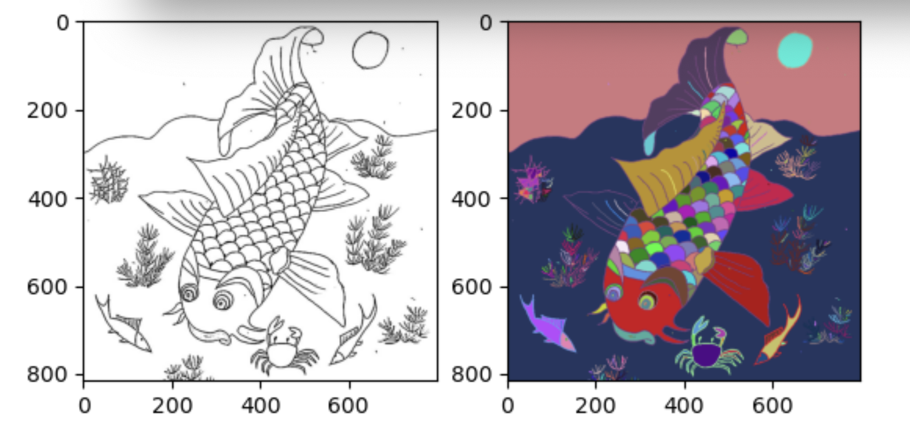

# Toán Cho Trí Tuệ Nhân Tạo

## Lab 3 - Giải Bài Toán Tô Màu Bằng Phương Pháp Phân Hoạch Đồ Thị
### Thành viên thực hiện
- Phạm Minh Thạch - 22C15018  
- Nguyễn Thị Hoàng Trang - 22C15045  

### BÀI TOÁN TÔ MÀU

#### Mô tả
Bài toán mà ta giải quyết tương tự như bài toán bé tập tô màu, ta nhận được một bức ảnh trắng đen. Các nét vẽ sẽ chia bức ảnh thành các khoảng trắng tách biệt nhau. Nhiệm vụ của chúng ta là tô màu vào các khoảng trắng, sao cho mỗi khoảng trắng sẽ được tô bởi chỉ một màu.

#### Input
Input là một bức ảnh trắng đen dạng RGB.

#### Output
Output là một bức ảnh màu dạng RGB. Ảnh được tô màu theo quy tắc như phần mô tả.

#### Phương pháp thực hiện
*Chuyển ảnh từ dạng RGB về dạng grayscale*  
Ảnh ban đầu có dạng RGB, mỗi điểm ảnh sẽ có 3 giá trị gồm Red, Green và Blue. Để thuận tiện cho việc tính toán, ta sẽ chuyển ảnh về dạng grayscale, mỗi điểm ảnh chỉ có một giá trị là gray.

*Chuyển ảnh từ dạng grayscale về dạng ma trận nhị phân*  
Trong bài toán này, chúng ta có hai đối tượng chính, đó là nét vẽ và khoảng trắng. Để thuận tiện cho việc gán nhãn, ta sẽ chuyển ảnh về dạng ma trận nhị phân. Khi điểm ảnh là nét vẽ thì ô tương ứng trên ma trận sẽ có giá trị 1, khi điểm ảnh là khoảng trắng ô sẽ có giá trị 0.

*Thực hiện gán nhãn cho các thành phần liên thông trên ma trận nhị phân*  
Trên ma trận nhị phân, mỗi ô sẽ có cạnh chung hoặc đỉnh chung với 8 ô xung quanh nó. Hai ô được gọi là giao nhau nếu chúng có cạnh chung hoặc đỉnh chung.  
Để đưa bài toán về dạng đồ thị, ta xem mỗi ô như một node của đồ thị. Hai ô liền kề nhau nếu chúng giao nhau và có cùng giá trị. Một thành phần liên thông sẽ bao gồm các ô liền kề nhau.  
Để thực hiện gán nhãn, ta lần lượt duyệt qua các ô, nếu ô đó có giá trị 0 và vẫn chưa gán nhãn, ta sẽ thực hiện gán nhãn cho thành phần liên thông xuất phát từ ô đó. Thuật toán dừng lại khi ta duyệt qua tất cả các ô.

*Thực hiện tô màu theo ma trận đã gán nhãn*  
Đầu tiên, ta tạo một ma trận có kích thước H x W x 3. Ma trận này sau đó sẽ được chuyển đổi thành ảnh màu RGB.
Giả sử, sau bước gán nhãn, ta có được số nhãn cần gán là K. Ta sẽ tạo ngẫu nhiên K màu tương ứng với K nhãn. Ta duyệt các ô trên ma trận nhãn, căn cứ vào giá trị của ô để xác định giá trị màu sắc cho ô tương ứng trên ma trận mới được tao ra.

*Chuyển đổi ma trận về dạng RGB*  
Sau khi đã hoàn thành việc điền các giá trị màu sắc cho các ô trên ma trận, ta chuyển đổi ma trận sang dạng ảnh RGB.

#### Một số kết quả của chương trình

Bên dưới là một kết quả của chương trình, ảnh trắng đen bên phải là input, output là ảnh màu bên trái.

#### Một số vấn đề gặp phải trong quá trình thực hiện
Nếu ta sử dụng Depth First Search để cài đặt thao tác gán nhãn, thì khi chạy trên những ảnh có kích thước lớn ta sẽ phải lỗi maximum recursion depth exceeded vì chương trình gọi đệ quy quá nhiều lần. Để giải quyết vấn đề này, nhóm đã chuyển sang cài đặt thao tác gán nhãn bằng thuật toán Breadth First Search.
